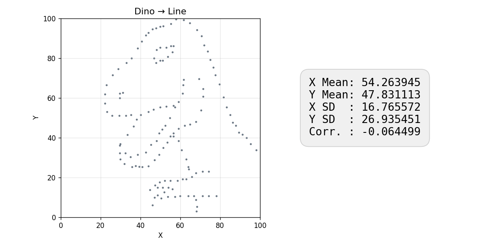
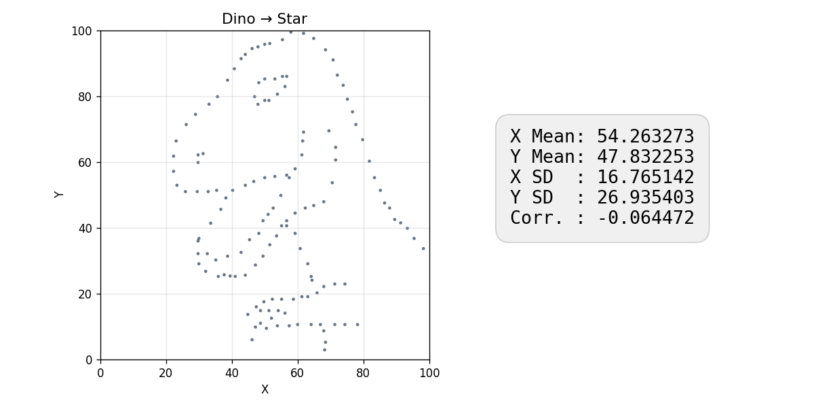

# Algorithm-Engineering

This is the Repository for the Course Algorithm-Engineering. 

**Student:** Justin Bergmann  
**E-Mail:** [justin.bergmann@uni-jena.de](mailto:justin.bergmann@uni-jena.de)

## About this repository

This repository is split into three directories:

- **answers**
  - contains answers to the Exam Assignments and solutions to the coding exercises
  - the answers are labeled the same way as the slides, e.g.: "01_Course_Intro..."
  - the solutions for the tasks of an assignment are labeled in the order they were given in the slides, e.g.: solution for the first task => "01_task..."
- **paper**
  - contains the paper for the project
- **project**
  - contains the project: Generating 2D Datasets With Similar Statistical Properties

---

## Datasaurus – Transformations

Simulated annealing transforms point clouds into target shapes while preserving the original summary statistics (mean, standard deviation, correlation).

<p align="center">
  
  
</p>
<p align="center">
  
  
</p>

<details>
<summary>All transformations combined</summary>
<p align="center">
  
</p>
</details>

> **Generate these GIFs yourself:** Open `project/Notebook/ExportGifs.ipynb` and run all cells. Output goes to `project/gifs/`.

---

## Datasaurus – Parameters

The optimizer accepts optional CLI parameters to tune the simulated annealing process. All have sensible defaults.

```
./project [OPTIONS] <input.csv> <target.csv>
```

| Flag | Default | Description |
|---|---|---|
| `-n, --iterations N` | `1000000000` | Number of optimization steps per thread. More iterations yield higher-quality results but take longer. |
| `--temp T` | `0.4` | Initial annealing temperature. Controls how aggressively the optimizer explores early on — higher values accept worse moves more often. |
| `--epsilon E` | `0.003` | Statistical tolerance. Maximum allowed deviation from the original dataset's mean, std dev, and correlation. Smaller = stricter preservation. |
| `-j, --threads J` | all cores | Number of parallel optimization chains. Each thread runs an independent simulated annealing chain; the best result wins. |
| `-o, --output FILE` | `./output_<target>_best.csv` | Output path for the final result. Defaults to current directory. |
| `-t, --timeline` | off | Save intermediate snapshots to `frames/` for animation. |
| `-b, --benchmark J` | off | Run benchmark mode: 5 runs for each thread count from 1 to J, then print a summary table with average time and energy. |

**Cooling rate** is computed automatically so the temperature decays from `--temp` to a fixed end temperature (~0.00002) over exactly `--iterations` steps:

$$\text{coolingRate} = \left(\frac{T_{end}}{T_{start}}\right)^{1/N}$$

This means you never need to manually calibrate the cooling rate when changing iterations or temperature.

### Examples

```bash
# Default run (1 billion iterations, temp=0.4, epsilon=0.003, all cores)
./project data/dino.csv data/circle.csv

# Quick test run with fewer iterations
./project -n 10000000 data/dino.csv data/circle.csv

# Use only 4 threads, save result to a specific path
./project -j 4 -o results/my_circle.csv data/dino.csv data/circle.csv

# High-precision run: tighter statistical constraint
./project --epsilon 0.001 data/dino.csv data/circle.csv

# Higher start temperature for more exploration, with timeline export
./project --temp 0.8 -n 2000000000 -t data/dino.csv data/line.csv

# Benchmark: test 1 to 8 threads, 5 runs each
./project -b 8 data/dino.csv data/circle.csv

# Benchmark with fewer iterations for a quick scaling test
./project -b 4 -n 100000000 data/dino.csv data/circle.csv
```

Benchmark output:

```
   Threads   Avg Time (s)     Avg Energy
----------------------------------------
         1          17.15          46.77
         2          17.23          42.31
         3          17.19          39.85
         4          17.21          38.12
```

Time stays roughly constant (each thread runs all iterations independently), while energy improves with more chains — more parallel attempts increase the chance of finding a better solution.

---

## Building

**Prerequisites:** CMake 3.28+, GCC 14+ with OpenMP support (tested with GCC 15.2.0)

> **Note:** Clang is not officially supported. The project uses `<print>` (C++23) and OpenMP, which require additional setup under Clang.

```bash
cd project
cmake -B build -DCMAKE_BUILD_TYPE=Release
cmake --build build
```

Run tests:

```bash
cd build && ctest
```

---

## Adding Custom Shapes

Any CSV file with `x,y` coordinate pairs (values in the 0–100 range) can be used as a target shape. No code changes needed:

```bash
# Create a target CSV (one point per line, x,y format)
echo "50,10
10,90
90,90
50,50" > data/diamond.csv

# Run the transformation
./build/project data/dino.csv data/diamond.csv
```

More points in the target CSV produce denser, more detailed shapes. Use `-t` to export timeline frames for animation.