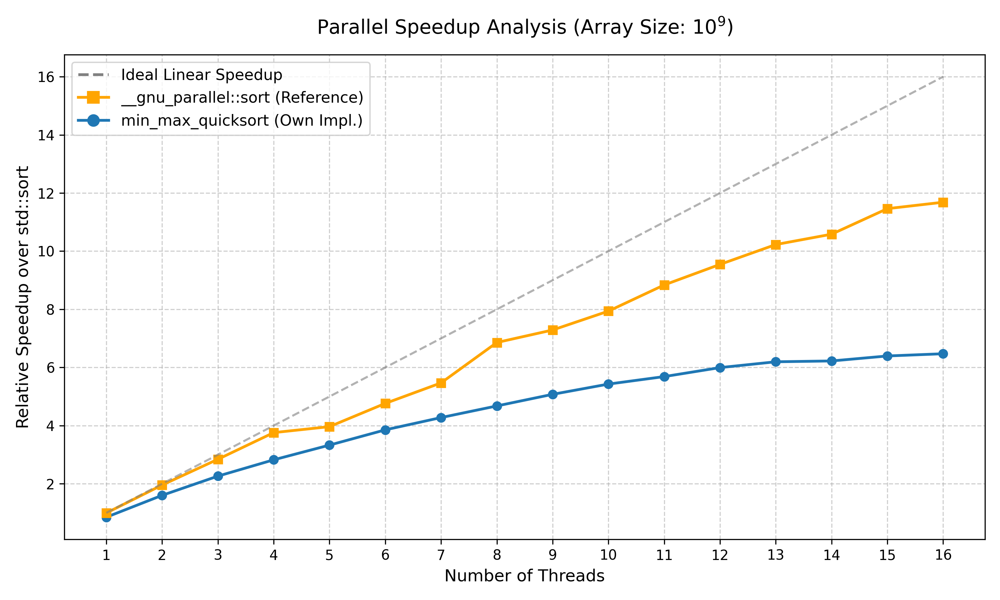
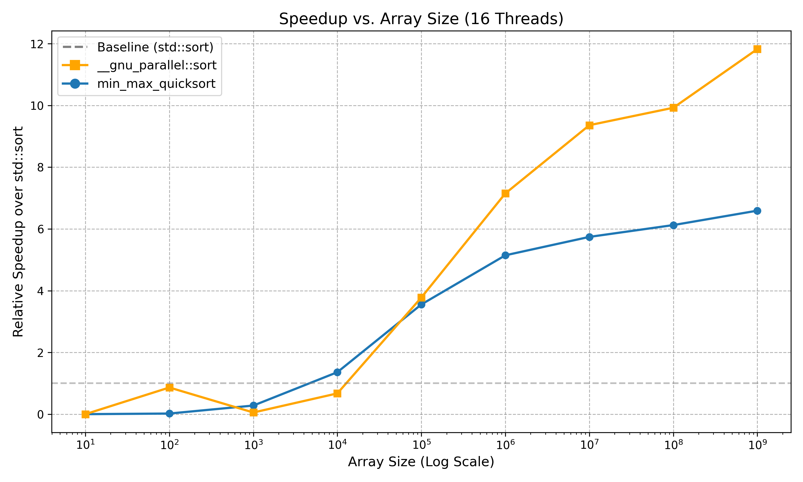

# Benchmarking Report: min_max_quicksort vs. std::sort and __gnu_parallel::sort

## 1. Introduction
- **Objective**: Benchmark the performance of the custom `min_max_quicksort` implementation against `std::sort` and `__gnu_parallel::sort` using OpenMP for parallelism.
- **Scope**: Focus on sorting large integer arrays (minimum size \(10^7\)) on a multi-core system.

## 2. Benchmarking Environment
- **Operating System**: macOS Tahoe 26.1
- **RAM**: 128 GB
- **CPU**: Apple M4 Max 16 cores (12 performance + 4 efficiency), 16 threads.
- **Compiler**: C: gcc-15 | C++: g++-15 
- **Flags**: -fopenmp -Ofast

## 3. Results

### 3.1 Graph 1: Relative Speedup vs. Number of Threads (Fixed \(N = 10^7\))

| Threads | min_max_quicksort Speedup over StD::Sort | __gnu_parallel::sort Speedup over StD::Sort |
|---|---|---|
| 1 | 0.85 | 0.99 |
| 2 | 1.60 | 1.96 |
| 3 | 2.26 | 2.84 |
| 4 | 2.82 | 3.76 |
| 5 | 3.33 | 3.96 |
| 6 | 3.85 | 4.76 |
| 7 | 4.28 | 5.47 |
| 8 | 4.68 | 6.86 |
| 9 | 5.08 | 7.29 |
| 10 | 5.43 | 7.94 |
| 11 | 5.69 | 8.84 |
| 12 | 6.00 | 9.54 |
| 13 | 6.20 | 10.23 |
| 14 | 6.22 | 10.58 |
| 15 | 6.40 | 11.46 |
| 16 | 6.47 | 11.68 |

### 3.2 Graph 2: Relative Speedup vs. Array Size (All Threads)

All tests for this speedup have been done using 16 Threads.

| Array Size | min_max_quicksort Speedup over StD::Sort | __gnu_parallel::sort Speedup over StD::Sort |
|---|---|---|
| $10^{1}$ | 0.00 | 0.00 |
| $10^{2}$ | 0.02 | 0.86 |
| $10^{3}$ | 0.28 | 0.05 |
| $10^{4}$ | 1.36 | 0.67 |
| $10^{5}$ | 3.55 | 3.78 |
| $10^{6}$ | 5.15 | 7.15 |
| $10^{7}$ | 5.74 | 9.36 |
| $10^{8}$ | 6.13 | 9.93 |
| $10^{9}$ | 6.59 | 11.83 |

## 4. Analysis and Discussion
#### 4.1Patterns in Graph: Parallel Speedup Analysis**:

  1. **Ideal Scaling:** As seen in the graph, the ideal linear speedup is not reached. 
   
  2. **Performance Gap:** The custom implementation `min_max_quicksort` is slightly slower than `__gnu_parallel::sort`.
   
  3. **Efficiency Drop:** At around 12 threads, both algorithms begin to show diminishing returns in terms of performance gain per additional thread.

#### Reasons: 
- **Overhead:** Parallel execution always incurs overhead (e.g., communication, thread creation, memory access). Therefore, perfect linear scaling is rarely achievable in practice.
  
-  **Algorithmic Differences:** min_max_quicksort contains non-parallel sections (e.g., partitioning is partly serial before tasks are spawned). In contrast, __gnu_parallel::sort is a highly optimized library specifically tuned for sorting, employing advanced strategies (likely Sample Sort or Multiway Mergesort) that leverage cache efficiency better.
   
- **Hardware Architecture:** The Apple M4 Pro chip used in this test features a hybrid architecture with 10 Performance cores and 4 Efficiency cores. The operating system prioritizes Performance cores. Once the thread count exceeds the number of Performance cores (around 10-12), the scheduler must utilize the slower Efficiency cores, which reduces the average speedup per thread.

#### 4.2 Observations on Array Size (Graph 2)
1. **Small Arrays:** Both `__gnu_parallel::sort` and `min_max_quicksort` perform worse than the baseline `(std::sort)` for array sizes below $10^4$.
   
2. **Scaling Point:** Starting at $10^5$ elements, `__gnu_parallel::sort` begins to scale significantly better than `min_max_quicksort`.

#### Reasons:

- **Parallel Overhead:** For small arrays, the overhead of managing threads and tasks outweighs the benefits of parallel processing. The serial algorithm `(std::sort)` is more efficient here as it avoids this overhead entirely.
 
- **Optimization at Scale:** While both parallel algorithms overtake the serial version at larger sizes, `__gnu_parallel::sort` pulls ahead due to its superior internal optimizations and better handling of memory bandwidth at scale compared to the custom implementation.